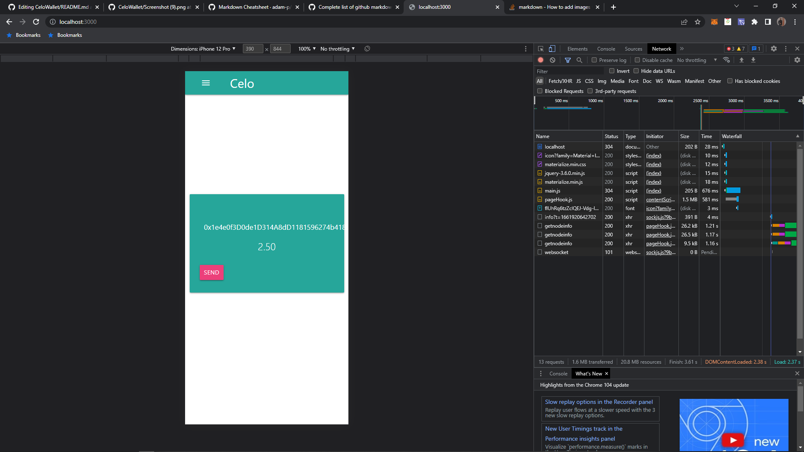
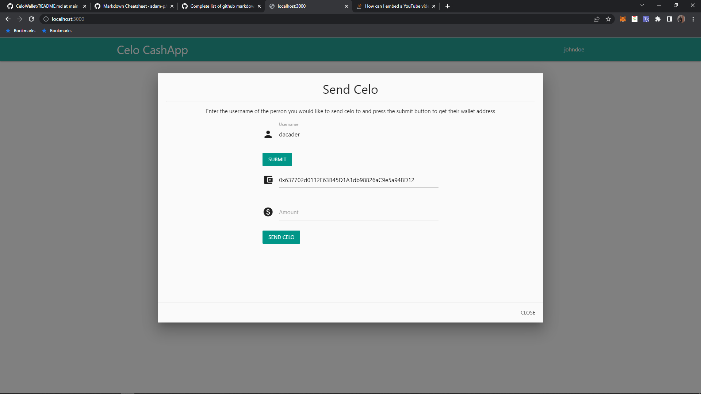

# Inspiration behind the project

https://www.youtube.com/watch?v=XyMaT3qASYk&t=9s

# Getting Started

Before you can operate this dapp you will need to fulfill the following requirements

## Install node js

  you can download it by clicking this link here :point_right: [node js](https://nodejs.org/en/download/)

  after installation you should be able to see your node version in a command prompt/terminal by typing 
  ```
  node --version
  ```
  
  
## Install packages
The dapp requires some packages and their dependencies in order to run sucessfully

we can install the packages by opeing the folder where this repository is cloned and typing

```
npm install
```

* Start the dapp

To start the dapp all you have to do is navigate to the directory where this repository is cloned and type the command below
```
npm run dev
```

When it has compiled successfully, you would get a local running instanc of the dapp on http://localhost:3000

but we are not completely done, we need a wallet to interact with our dapp. if you are using chrome, you can download the celowallet extension from this link

https://chrome.google.com/webstore/detail/celoextensionwallet/kkilomkmpmkbdnfelcpgckmpcaemjcdh?hl=en

1. Create a wallet
2. Get faucet CELO annd cUSD from https://celo.org/developers/faucet by adding your wallet address and ansering the captcha
3. Switch to the alfajores testnet in the CeloExtensionWallet as it has been in the mainnet all this while.


## Using the Dapp

Initially you would notice that the indicator at the top right which changes from loading ...  *** to no name give *** 

you can use the create name button to create an alias for yourself which others will use to find you wallet address easily and send money easily.

Currently if you submit name like 'dacader','helloworld' etc it will provide the wallet address associated with it like in the example below




## Build
In order to build your project/dapp just enter 
``` npm run build ``
in a terminal that has been navigated to the repos directory
